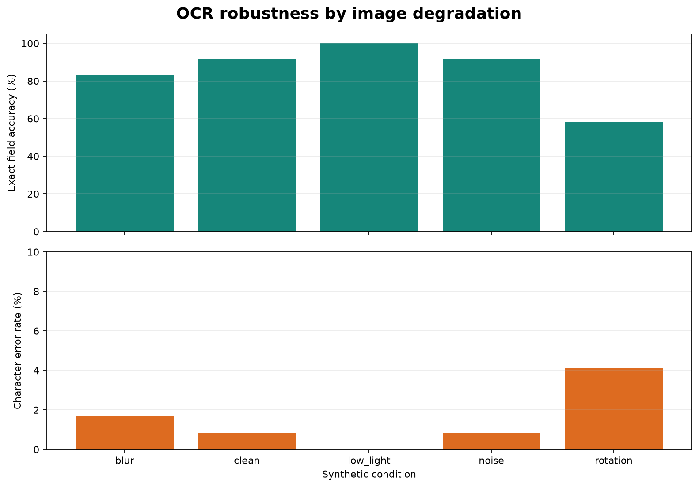
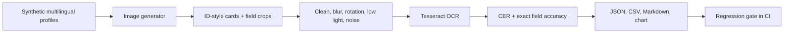

# OCR Accuracy & Regression Lab

[](https://github.com/ashrafessa4/ocr-accuracy-lab/actions/workflows/ocr-benchmark.yml)
[](https://www.python.org/)

A synthetic-only test harness for measuring Tesseract OCR quality on identity-style images in English, Hebrew, and Arabic. It reports character error rate (CER), exact field accuracy, robustness under image degradation, and regressions between configurations.



## Baseline result

The committed Tesseract 5.5 baseline contains 60 field-level observations:

| Language | Character error rate | Exact field accuracy |
| --- | ---: | ---: |
| English | 1.1% | 90.0% |
| Hebrew | 0.9% | 90.0% |
| Arabic | 2.5% | 75.0% |
| **Overall** | **1.5%** | **85.0%** |

These values are evidence, not a claim that the synthetic set represents production traffic. The
full predictions are available in [`reports/baseline/results.csv`](reports/baseline/results.csv).

## Why this project exists

OCR systems can appear accurate while silently failing on one script, field, or capture condition. This tool turns OCR quality into repeatable test evidence and a CI gate. It uses no real identity documents, personal information, employer data, or proprietary verification logic.

## What it demonstrates

- Python package design, type-conscious code, pytest, coverage, and Ruff
- English, Hebrew, and Arabic OCR evaluation
- Programmatic synthetic identity images with an explicit CC0-1.0 manifest
- Character error rate and exact field-level accuracy
- Deterministic blur, rotation, low-light, and noise perturbations
- JSON, CSV, Markdown, and PNG reports
- Configurable regression thresholds with a non-zero CI exit code
- Linux CI against multiple Python versions and a real Tesseract runtime

## Data and evaluation flow



## Quick start

Prerequisites: Python 3.11+ and Tesseract 5.

```bash
python -m venv .venv
# Linux/macOS: source .venv/bin/activate
# Windows: .venv\Scripts\activate
python -m pip install -e ".[dev]"

ocrbench download-models --destination .tessdata
ocrbench generate
ocrbench evaluate --tessdata-dir .tessdata --output-dir reports/current
```

Run quality checks:

```bash
ruff check .
pytest
```

Compare a candidate run to the baseline:

```bash
ocrbench compare \
  reports/baseline/results.json \
  reports/current/results.json \
  --max-cer-increase 0.03 \
  --max-accuracy-drop 0.05
```

The comparison exits with code `1` when either threshold is exceeded, which makes it suitable for CI quality gates.

## Benchmark design

The generator creates one clearly watermarked, non-valid identity layout per language. Four fields are evaluated independently—name, document ID, date of birth, and expiry—across five image conditions. That produces 15 card images and 60 field-level OCR observations per run.

| Metric | Meaning |
| --- | --- |
| Character error rate | Insertions, deletions, and substitutions divided by expected characters; lower is better |
| Exact field accuracy | Share of fields matching after Unicode/whitespace normalization; higher is better |
| Regression delta | Candidate metric minus the committed baseline, evaluated overall and per language |

## Reproducibility and ethics

- The dataset is generated from hard-coded fictional values and marked `SYNTHETIC / NOT VALID`.
- The manifest records data provenance and a CC0-1.0 dedication.
- Noise uses deterministic seeds so results are reproducible.
- Open Tesseract language models are downloaded from the official `tessdata_fast` repository.
- Results can vary slightly across Tesseract and font versions; the report records runtime metadata.
- RTL-only lines are converted from Tesseract visual order to logical Unicode order before scoring;
  Hebrew and Arabic runs also load the English model for Latin digits.

## License

Code is MIT licensed. Generated synthetic dataset content is dedicated CC0-1.0 as recorded in its manifest.
